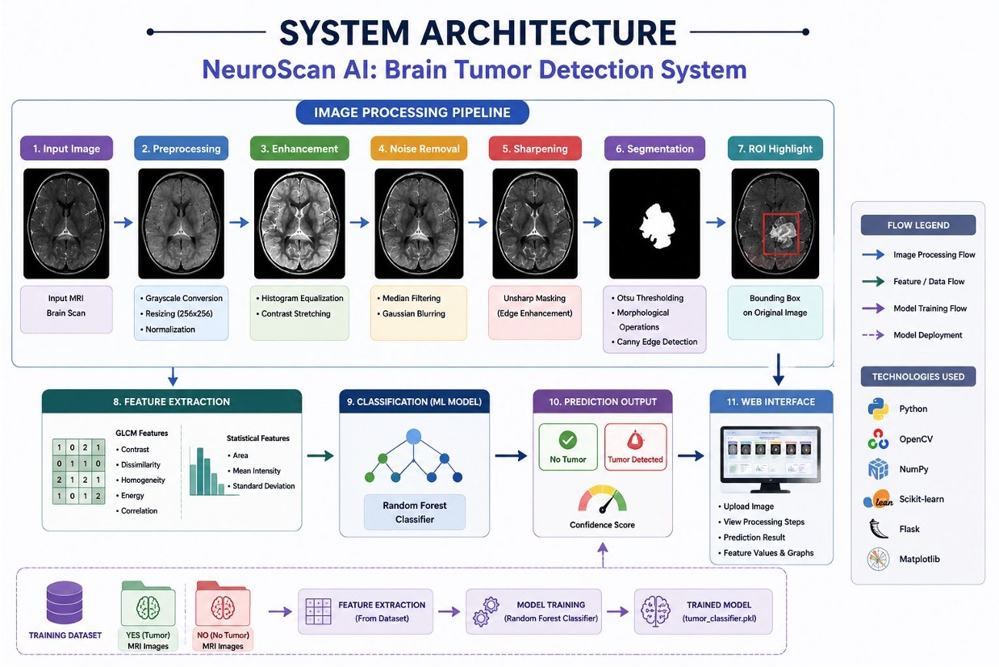
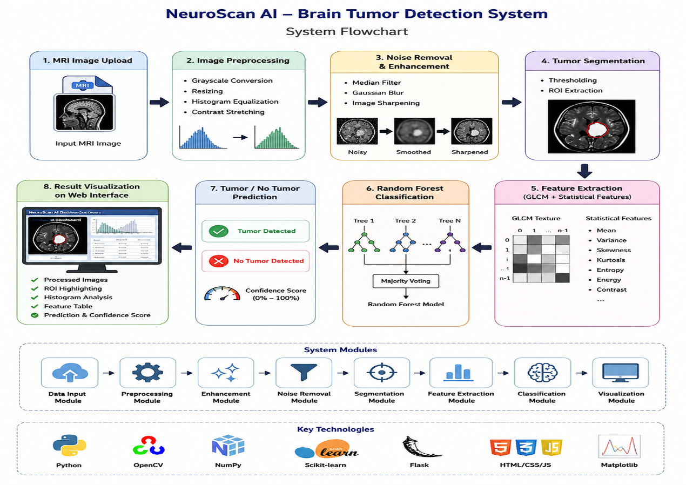
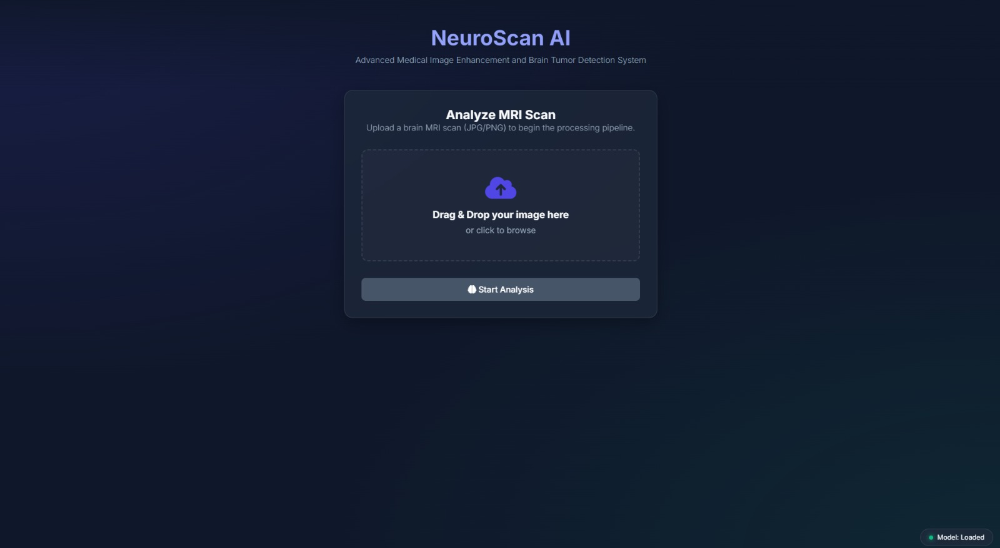
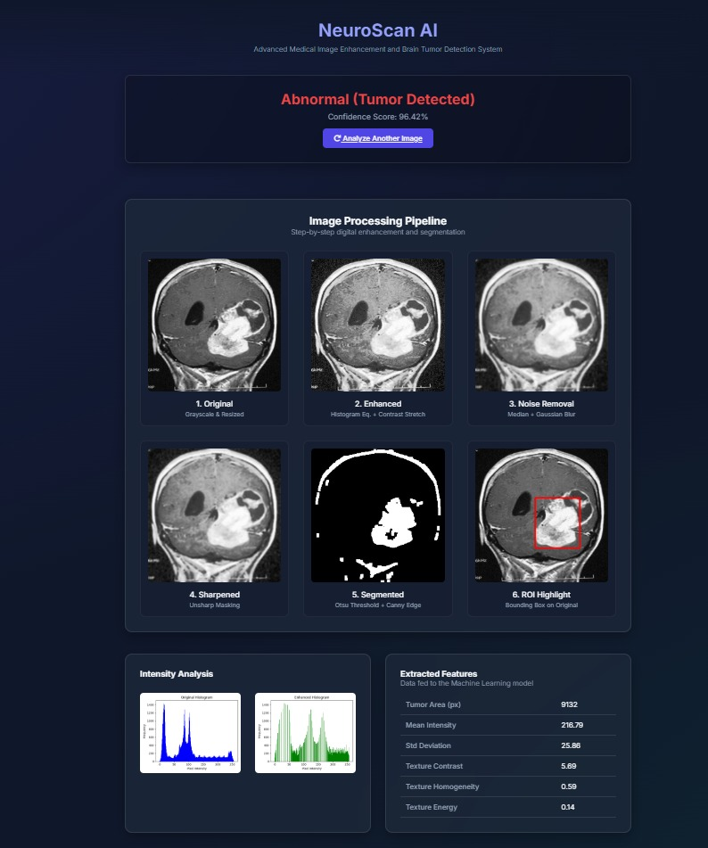
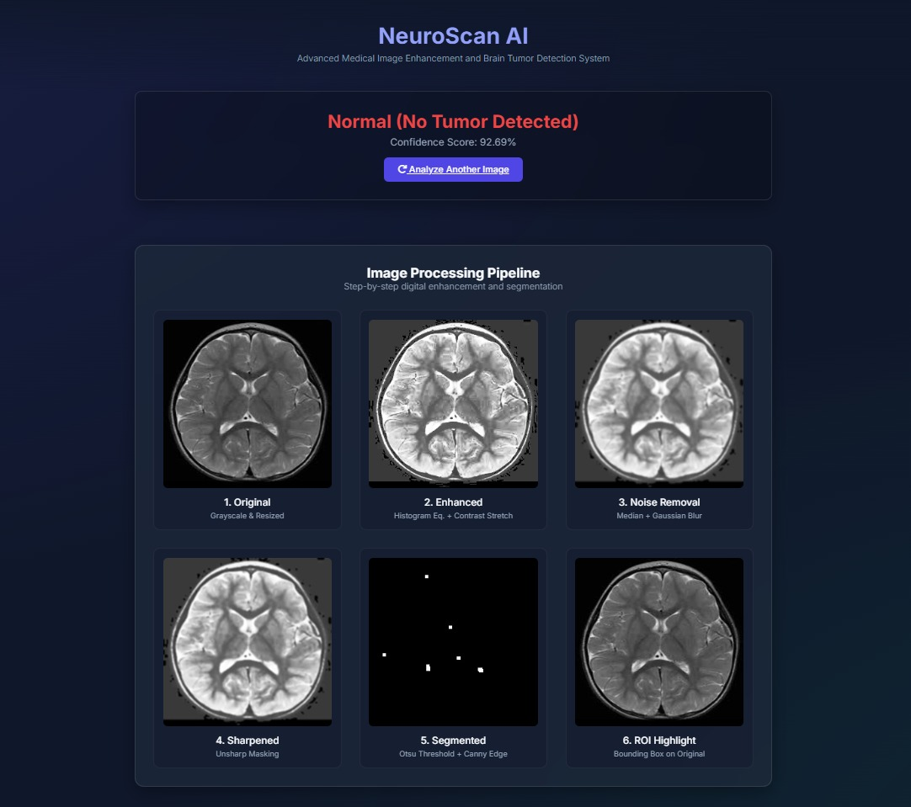
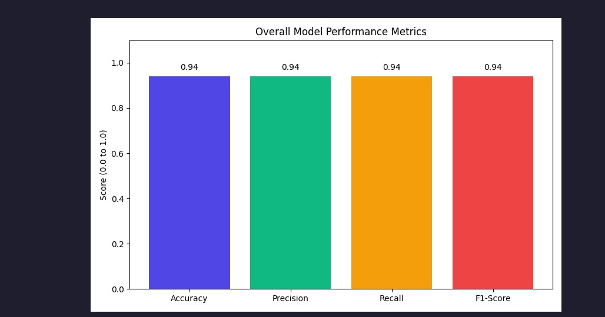

# 🧠 NeuroScan AI – Brain Tumor Detection System

An AI-powered medical image analysis system that detects brain tumors from MRI scans using advanced image processing techniques and machine learning. The system enhances MRI images, segments tumor regions, extracts meaningful features, and classifies scans as **Tumor** or **No Tumor** through an interactive Flask-based web application.

---

## 📌 Overview

Brain tumors are among the most critical neurological disorders, and early detection plays a vital role in improving treatment outcomes. Manual MRI analysis can be time-consuming and heavily dependent on radiologist expertise.

**NeuroScan AI** addresses this challenge by automating the detection process through a complete image processing and machine learning pipeline. The system enhances MRI scans, identifies suspicious tumor regions, extracts statistical and texture features, and predicts whether a tumor is present.

The project combines explainable image processing techniques with a lightweight machine learning model, making it suitable for educational, research, and prototype healthcare applications.

---

## 🎯 Problem Statement

Brain tumor detection through MRI analysis presents several challenges:

* Manual diagnosis is time-consuming.
* Detection accuracy depends on radiologist expertise.
* MRI images often contain noise and low contrast.
* Tumor boundaries can be difficult to identify.
* Existing systems often focus only on classification without providing visual explanations.

This project aims to develop an automated system capable of:

* Enhancing MRI image quality
* Removing noise
* Segmenting tumor regions
* Extracting meaningful image features
* Classifying MRI scans accurately
* Visualizing the entire processing workflow

---

## 🚀 Objectives

* Enhance MRI image quality using image processing techniques.
* Remove noise and improve tumor visibility.
* Accurately segment suspicious tumor regions.
* Extract statistical and texture-based features.
* Classify MRI scans as Tumor or No Tumor.
* Develop an interactive Flask-based diagnostic dashboard.
* Provide visual explanations for predictions.

---

# 🏗️ System Architecture

The following architecture illustrates the complete NeuroScan AI pipeline, including image processing, feature extraction, machine learning classification, and web deployment.

<p align="center">
  
</p>


### Image Processing Pipeline

1. MRI Image Input
2. Preprocessing

   * Grayscale Conversion
   * Image Resizing (256×256)
   * Normalization
3. Image Enhancement

   * Histogram Equalization
   * Contrast Stretching
4. Noise Removal

   * Median Filtering
   * Gaussian Blurring
5. Image Sharpening

   * Unsharp Masking
6. Tumor Segmentation

   * Otsu Thresholding
   * Morphological Operations
   * Canny Edge Detection
7. ROI (Region of Interest) Highlighting

### Machine Learning Pipeline

1. Feature Extraction

   * GLCM Texture Features

     * Contrast
     * Dissimilarity
     * Homogeneity
     * Energy
     * Correlation
   * Statistical Features

     * Area
     * Mean Intensity
     * Standard Deviation

2. Classification

   * Random Forest Classifier

3. Prediction

   * Tumor / No Tumor Detection
   * Confidence Score Generation

4. Web Deployment

   * Flask-based Interactive Dashboard
   * Visualization of Processing Stages
   * Feature Analysis and Prediction Results

---

# 🔄 System Flowchart

The flowchart below demonstrates the end-to-end workflow from MRI image upload to final prediction and visualization.

<p align="center">
  
</p>

### Workflow

MRI Image Upload

⬇️

Image Preprocessing

⬇️

Image Enhancement

⬇️

Noise Removal & Sharpening

⬇️

Tumor Segmentation

⬇️

Feature Extraction

⬇️

Random Forest Classification

⬇️

Tumor / No Tumor Prediction

⬇️

Confidence Score Generation

⬇️

Web-Based Visualization Dashboard

---

# 🛠️ Technology Stack

| Technology          | Purpose               |
| ------------------- | --------------------- |
| Python              | Core Development      |
| OpenCV              | Image Processing      |
| NumPy               | Numerical Computation |
| Scikit-Learn        | Machine Learning      |
| Flask               | Web Framework         |
| Matplotlib          | Data Visualization    |
| HTML/CSS/JavaScript | Frontend Development  |

---

# 📂 Dataset

The project uses MRI brain scan images divided into two categories:

```text
brain_tumor_dataset/
├── yes/
└── no/
```

* **yes/** → MRI scans containing tumors
* **no/** → MRI scans without tumors

The dataset is used for feature extraction, model training, validation, and testing.

---

# 🤖 Machine Learning Model

## Random Forest Classifier

The system uses a Random Forest Classifier trained on extracted image features.

### Why Random Forest?

* High classification accuracy
* Robust against overfitting
* Efficient for tabular feature-based learning
* Easy to interpret compared to deep neural networks
* Fast prediction time

The model is trained using both statistical and texture-based features extracted from segmented tumor regions.

---

# ⚙️ Project Workflow

```text
MRI Upload
      ↓
Preprocessing
      ↓
Image Enhancement
      ↓
Noise Removal
      ↓
Image Sharpening
      ↓
Tumor Segmentation
      ↓
Feature Extraction
      ↓
Random Forest Classification
      ↓
Prediction Generation
      ↓
Result Visualization
```

---

# 📊 Features Extracted

## Statistical Features

* Area
* Mean Intensity
* Standard Deviation

## GLCM Texture Features

* Contrast
* Dissimilarity
* Homogeneity
* Energy
* Correlation

These features help the machine learning model distinguish between normal and tumor-containing MRI scans.

---

# 📈 Results

| Metric    | Score |
| --------- | ----- |
| Accuracy  | 94%   |
| Precision | 94%   |
| Recall    | 94%   |
| F1-Score  | 94%   |

### Outputs

✅ Accurate Tumor Segmentation

✅ ROI Detection and Highlighting

✅ Real-Time Prediction

✅ Confidence Score Generation

✅ Visualization of Intermediate Processing Stages

✅ Interactive Flask Dashboard

---

# 📷 Project Screenshots

The following screenshots demonstrate the MRI processing pipeline, tumor detection results, feature extraction, and model performance.

<p align="center">
  
  
</p>

<p align="center">
  
  
</p>
---

# 📁 Project Structure

```text
Brain-Tumor-Detection-System/
│
├── brain_tumor_dataset/
│   ├── yes/
│   └── no/
│
├── screenshots/
│   ├── system_architecture.jpg
│   ├── flowchart.png
│   ├── Screenshot_1.jpeg
│   ├── Screenshot_2.jpeg
│   ├── Screenshot_3.jpeg
│   └── Model_performance_metrics.jpeg
│
├── core/
├── static/
├── templates/
│
├── app.py
├── train_model.py
├── test_seg.py
├── tumor_classifier.pkl
├── requirements.txt
├── README.md
└── .gitignore
```

---

# 💻 Installation

## Clone the Repository

```bash
git clone https://github.com/AnanyaGaikwad/Brain-Tumor-Detection-System.git
cd Brain-Tumor-Detection-System
```

## Install Dependencies

```bash
pip install -r requirements.txt
```

## Run the Application

```bash
python app.py
```

## Open in Browser

```text
http://127.0.0.1:5000
```

---

# ✨ Key Features

* MRI Image Enhancement
* Noise Reduction
* Tumor Segmentation
* ROI Detection
* GLCM Feature Extraction
* Statistical Feature Extraction
* Random Forest Classification
* Confidence Score Prediction
* Interactive Flask Dashboard
* Visual Processing Pipeline
* Explainable Results

---

# 🔮 Future Scope

* Deep Learning Integration (CNN, U-Net)
* Multi-Class Brain Tumor Classification
* 3D MRI Volume Analysis
* Cloud-Based Deployment
* Hospital Integration
* Explainable AI (XAI)
* Larger Medical Datasets
* Real-Time Clinical Decision Support

---

# 👥 Team Members

* Ananya Gaikwad
* Teesha Madan
* Satyam Kumar
* Saumya Dhorje

Department of Artificial Intelligence and Data Science (AIDS)

Vishwakarma Institute of Technology, Pune

---

# 📜 License

This project was developed for academic and educational purposes. Feel free to use and modify it for learning and research.
 radiologists and healthcare professionals by providing faster, explainable, and automated brain tumor detection from MRI images.
